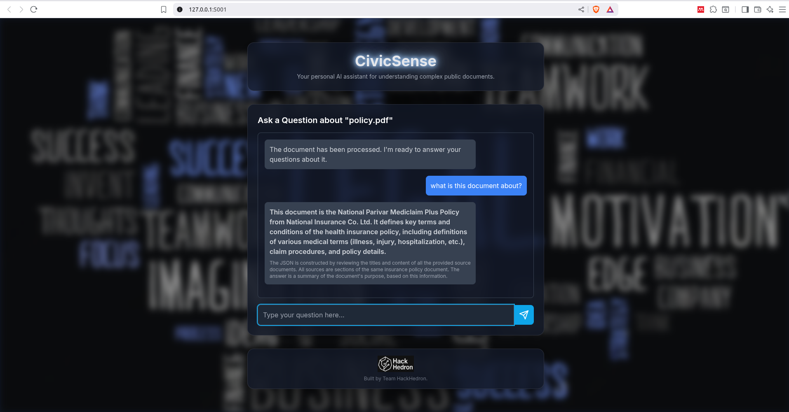

# CivicSense AI

CivicSense AI is an intelligent assistant that helps users understand **complex public documents** such as government policies, legal texts, and reports.  
Upload a document (PDF/DOCX), and CivicSense will process it, chunk the content, embed it locally with MiniLM, and answer your questions using Google’s **Gemini models**.

**Note**: You can try the demo of the model at : https://civicsense-ai.onrender.com/
---

##  Working

###  Uploading a Document


###  Asking Questions



---

##  Getting Gemini API Keys

This project uses **Google Generative AI (Gemini) API** for question answering.  
You need a **Google Cloud project** with the Generative AI API enabled.

### Step 1: Create a Google Cloud Project
1. Go to [Google Cloud Console](https://console.cloud.google.com/).
2. Click **Select a project → New Project**.
3. Give it a name (e.g., `civicsense-ai`) and click **Create**.

### Step 2: Enable the Gemini API
1. In the Cloud Console, open the **Navigation menu → APIs & Services → Library**.
2. Search for **Generative Language API** (Gemini).
3. Click **Enable**.

### Step 3: Create an API Key
1. Go to **APIs & Services → Credentials**.
2. Click **Create Credentials → API Key**.
3. Copy the generated API key.

### Step 4: (Optional but Recommended) Create a Service Account
1. Go to **IAM & Admin → Service Accounts**.
2. Click **Create Service Account**.
3. Assign it the role **Vertex AI User**.
4. Generate a JSON key and download it (this will be your `service-account.json`).

---

##  Setup & Installation


1. Clone this repository:  
   ```git clone https://github.com/Hari-Sri-T/CivicSense-AI ```

2. Navigate into the project folder:  
  ``` cd civicsense-ai  ```

3. Create and activate a virtual environment:  
  ``` python3 -m venv venv  ```

   ``` source venv/bin/activate  ```

4. Install dependencies:  
   ```pip install -r requirements.txt  ```

5. Clone all-MiniLM-L6-v2 repository
   ```git clone https://huggingface.co/sentence-transformers/all-MiniLM-L6-v2```


5. Create a `.env` file in the project root with your keys:  
   GOOGLE_API_KEY="your_api_key_here"  
   GOOGLE_PROJECT_ID="your_project_id_here"  
   GOOGLE_REGION="asia-south1"  
   GOOGLE_APPLICATION_CREDENTIALS="/path/to/service-account.json"  

---

## Running the App

1. Start the backend:  
   python3 app.py  

   The app will run on: http://127.0.0.1:5001  

2. Open the frontend (index.html) in your browser.  

3. Upload a document, then ask your questions in the chat interface.  

---

## Built With
- Flask – Backend API  
- Hugging Face Transformers – Local MiniLM embeddings  
- Google Gemini API – Question answering  
- TailwindCSS – Modern frontend styling  


---

##  Team
Built  by <br>
<br>

